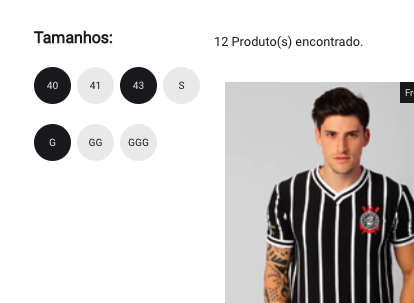

# Front end Recruitment Test

#### Features
- Add and remove products from the floating cart
- Sort products by highest to lowest and lowest to highest price


- Filter products by available sizes



- Products persist in floating cart even after page reloads
- Responsive design for desktop, tablets and mobile
- Product stoppers for free shipping

#### Using
- React
  * Redux - state management
- Nodejs
  * Express CORS Middleware (Node and React run in different port)
  * Nodemon - for a better development experience
  * Concurrently - To run multiple tasks at once
- Axios - for promise HTTP requests
- Native local storage - to persist products in cart even after page reload
- CSS
  * BEM methodology
  * SASS

## Build/Run

``` javascript

/* Install the needed packages */
npm i

/* Run both Node server and React */
npm start

/* The React app should open automatically  on localhost:3000 */


```


